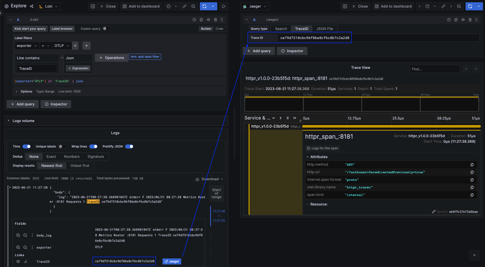
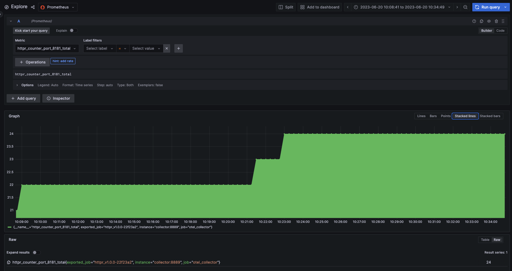
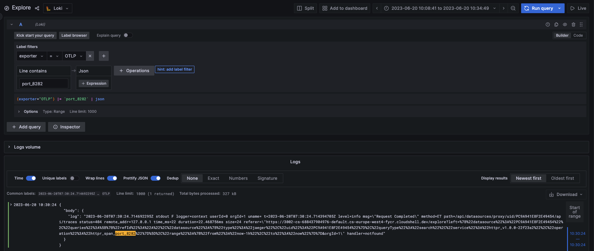
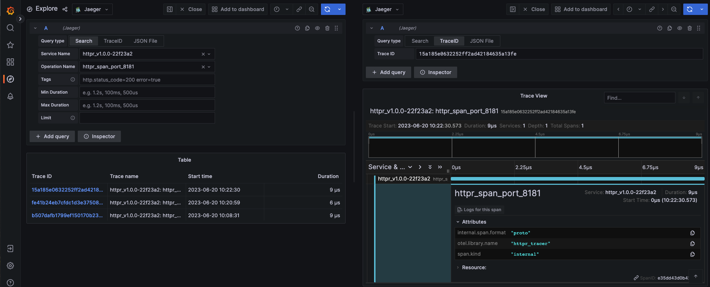

## httpr

This is a demo Hello World project instrumented with tracing and metric export to showcase the functionality of a monitoring stack when deployed on GKE.

### Components:
1. OpenTelemetry
2. Prometheus
3. Fluent-bit
4. Grafana Loki
5. Grafana
6. Jaeger

### Description:
This simple Go server uses the gorilla/mux package for HTTP request routing.
The code creates two HTTP routers (router1 and router2), each handling its own port. It also creates a RequestCounter to track the number of requests on each port. Each request handler increments the respective counter and responds with the current request count.

### Installation:
1. Build the image by running `make image`.
2. Push the image using `docker push [image name]`.
3. Go to Cloud Shell Editor and clone the project.
4. Run `terraform init`, `terraform plan`, and `terraform apply`, providing the GitHub owner, token, and project when prompted.
5. Repeat `terraform apply` if necessary.
6. Verify that the Flux repository has been created.
7. Install the Flux CLI.
8. Run `gcloud container clusters get-credentials main --zone us-central1-c --project [project]`.
9. Add the YAML manifests to the Flux repository and set the variables for the httpr image (`spec:containers:name`) and version (`VERSION`).
10. Commit the changes.
11. Run `flux logs -f` to ensure Flux has detected the changes.
12. Run `kubectl get po -n httpr` and check the status of the pods.
13. Run the following commands:
   - `kubectl port-forward deploy/httpr 8181:8181 -n httpr &`
   - `kubectl port-forward deploy/httpr 8282:8282 -n httpr &`
   - `kubectl port-forward deploy/grafana 3002:3002 -n httpr &`

14. Run web previews on ports 8181 and 8282 to verify that the counter increases with page refreshes.
15. Run a web preview on port 3002 to access Grafana.
16. Verify that data sources for Jaeger, Loki, and Prometheus are available.
17. Verify that logs, metrics, and traces are present in Jaeger, Loki, and Prometheus.

Below is an example of monitoring screenshots:

1. Logs to trace integration

2. Prometheus

3. Loki

4. Jaeger

TO DO:
- Add Helm and GitHub Actions
- Extend Fluent-bit filtering
- Optimize code